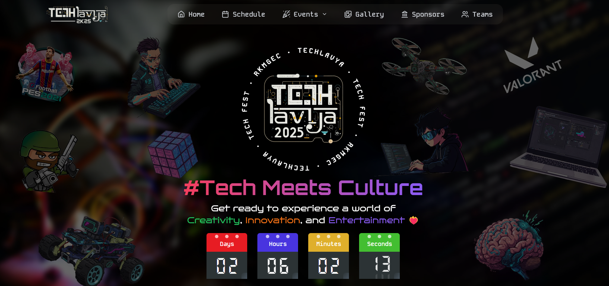

# Techlavya

Techlavya is the official **Tech Fest website** of **Ramkrishna Mahato Government Engineering College**. This platform showcases the latest events, competitions, and workshops organized as part of the fest.

## 🚀 Visit Our Website

[](https://techlavya-rkmgec.com/)

## 🎨 Preview



## 📌 Features
- Interactive landing page with event details
- Dynamic schedule of competitions and workshops
- Online registration for events
- Responsive design for seamless access across devices
- Smooth animations and user-friendly interface

## 🛠️ Tech Stack
- **Frontend:** Next.js, Tailwind CSS, Framer Motion
- **Deployment:** Vercel

## 🔧 Installation & Setup

To run the project locally, follow these steps:

1. **Clone the repository:**
   ```bash
   git clone https://github.com/TechLavya/techlavya-website.git
   cd techlavya-website
   ```

2. **Install dependencies:**
   ```bash
   npm install
   ```

3. **Run the development server:**
   ```bash
   npm run dev
   ```
   The site will be available at `http://localhost:3000`

## 🤝 Contributors
We welcome contributions! Feel free to fork this repository, submit issues, or create pull requests.

⭐ **Follow, contribute, and help us make Techlavya even better!** 🚀